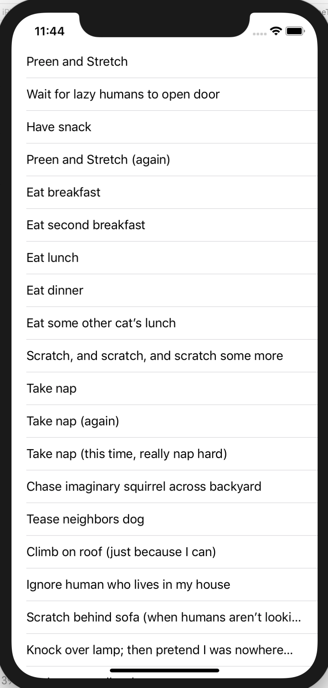

# iOS-FelineTodoList

## CODING EXERCISE:

One of the potential benefits of the **Model-View-ViewModel (MMVM)** design pattern is its ability to resolve the __*"Massive-View-Controller Problem"*__ by focusing `View Controllers` to their intended purpose: Responding to `View` lifecycle events.

Your task in this exercise is to apply this principle of MVVM to the `Viewcontroller` in the starter app by rededicating it to only its originally intended purpose.

### Required Resources:

1. This `FelineTaskList4` starter app.
- The app

  
